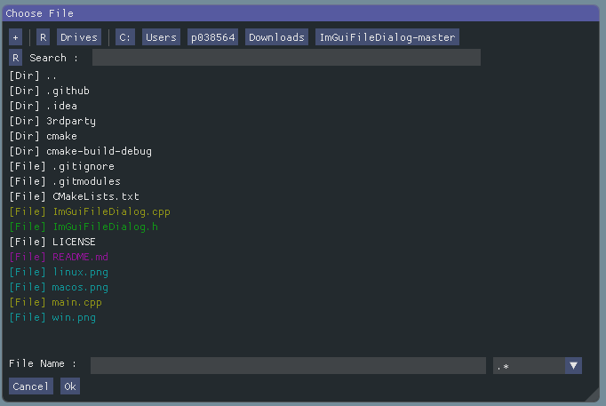

  

Last Github Actions Builds : [Win](https://github.com/aiekick/ImGuiFileDialog/actions?query=workflow%3AWin) / [Linux](https://github.com/aiekick/ImGuiFileDialog/actions?query=workflow%3ALinux) / [Osx](https://github.com/aiekick/ImGuiFileDialog/actions?query=workflow%3AOsx)

# ImGuiFileDialog

An example of the File Dialog integrated within the ImGui Demo App

- Separate system for call and display
- Can use custom pane via function binding
  - this pane can block the validation of the dialog
  - can also display different things according to current filter and User Datas
- Support of Filter Coloring
- Multi Selection (ctrl/shift + click) :
  - 0 => infinite
  - 1 => one file (default)
  - n => n files
- Compatible with MacOs, Linux, Win
  - On Win version you can list Drives
- Support of Modal/Standard dialog type

## Simple Dialog :
```cpp
void drawGui()
{ 
  // open Dialog Simple
  if (ImGui::Button("Open File Dialog"))
    ImGuiFileDialog::Instance()->OpenDialog("ChooseFileDlgKey", "Choose File", ".cpp\0.h\0.hpp\0\0", ".");

  // display
  if (ImGuiFileDialog::Instance()->FileDialog("ChooseFileDlgKey")) 
  {
    // action if OK
    if (ImGuiFileDialog::Instance()->IsOk == true)
    {
      std::string filePathName = ImGuiFileDialog::Instance()->GetFilepathName();
      std::string filePath = ImGuiFileDialog::Instance()->GetCurrentPath();
      // action
    }
    // close
    ImGuiFileDialog::Instance()->CloseDialog("ChooseFileDlgKey");
  }
}
```


## Dialog with Custom Pane :
```cpp
static bool canValidateDialog = false;
inline void InfosPane(std::string vFilter, UserDatas vUserDatas, bool *vCantContinue) // if vCantContinue is false, the user cant validate the dialog
{
	ImGui::TextColored(ImVec4(0, 1, 1, 1), "Infos Pane");
	ImGui::Text("Selected Filter : %s", vFilter.c_str());
	ImGui::Checkbox("if not checked you cant validate the dialog", &canValidateDialog);
	if (vCantContinue)
	    *vCantContinue = canValidateDialog;
}

void drawGui()
{
  // open Dialog with Pane
  if (ImGui::Button("Open File Dialog with a custom pane"))
    ImGuiFileDialog::Instance()->OpenDialog("ChooseFileDlgKey", "Choose File", ".cpp\0.h\0.hpp\0\0",
            ".", "", std::bind(&InfosPane, std::placeholders::_1, std::placeholders::_2, std::placeholders::_3), 350, 1, "InfosPane");

  // display and action if ok
  if (ImGuiFileDialog::Instance()->FileDialog("ChooseFileDlgKey")) 
  {
    if (ImGuiFileDialog::Instance()->IsOk == true)
    {
		std::string filePathName = ImGuiFileDialog::Instance()->GetFilepathName();
		std::string filePath = ImGuiFileDialog::Instance()->GetCurrentPath();
		std::string filter = ImGuiFileDialog::Instance()->GetCurrentFilter();
		// here convert from string because a string was passed as a userDatas, but it can be what you want
		auto userDatas = std::string((const char*)ImGuiFileDialog::Instance()->GetUserDatas()); 
		auto selection = ImGuiFileDialog::Instance()->GetSelection(); // multiselection

		// action
    }
    // close
    ImGuiFileDialog::Instance()->CloseDialog("ChooseFileDlgKey");
  }
}
```


## Filter Coloring

```cpp
ImGuiFileDialog::Instance()->SetFilterColor(".cpp", ImVec4(1,1,0,0.5));
ImGuiFileDialog::Instance()->SetFilterColor(".h",   ImVec4(0,1,0,0.5));
ImGuiFileDialog::Instance()->SetFilterColor(".hpp", ImVec4(0,0,1,0.5));
ImGuiFileDialog::Instance()->SetFilterColor(".md",  ImVec4(1,0,1,0.5));
ImGuiFileDialog::Instance()->SetFilterColor(".png", ImVec4(0,1,1,0.5));
```



## Multi Selection

You can define in OpenDialog call the count file you wan to select :
- 0 => inifnite
- 1 => one file only (default)
- n => n files only

See the define at the end of these funcs after path.

```cpp
ImGuiFileDialog::Instance()->OpenDialog("ChooseFileDlgKey", "Choose File", ".*\0.cpp\0.h\0.hpp\0\0", ".");
ImGuiFileDialog::Instance()->OpenDialog("ChooseFileDlgKey", "Choose 1 File", ".*\0.cpp\0.h\0.hpp\0\0", ".", 1);
ImGuiFileDialog::Instance()->OpenDialog("ChooseFileDlgKey", "Choose 5 File", ".*\0.cpp\0.h\0.hpp\0\0", ".", 5);
ImGuiFileDialog::Instance()->OpenDialog("ChooseFileDlgKey", "Choose many File", ".*\0.cpp\0.h\0.hpp\0\0", ".", 0);
ImGuiFileDialog::Instance()->OpenDialog("ChooseFileDlgKey", "Choose File", ".png\0.jpg\0\0",
   ".", "", std::bind(&InfosPane, std::placeholders::_1, std::placeholders::_2, std::placeholders::_3), 350, 1, "SaveFile"); // 1 file
```


## Using ImGuiFileDialog as a module

You can customize ImGuiFileDialog for avoid code modification/adaptation.

You just need to write your own config file by override the file : ImGuiFileDialog/ImGuiFileDialogConfig.h
like i do here with CustomImGuiFileDialogConfig.h

After that, for let ImGuiFileDialog your own custom file,
you must define the preprocessor directive CUSTOM_IMGUIFILEDIALOG_CONFIG with the path of you custom config file.
This path must be relative to the directory where you put ImGuiFileDialog module.

Thats all.

You can check by example in this repo with the file CustomImGuiFileDialogConfig.h :
- this trick was used for have custom icon font instead of labels for buttons or messages titles
- you can also use your custom imgui button, the button call stamp must be same by the way :)

The Custom Icon Font (in [CustomFont.cpp](CustomFont.cpp) and [CustomFont.h](CustomFont.h)) was made with [ImGuiFontStudio](https://github.com/aiekick/ImGuiFontStudio) i wrote for that :)
ImGuiFontStudio is using also ImGuiFileDialog.

